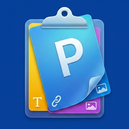

  
  <h1>Paste Me - Trình quản lý Clipboard hiện đại cho macOS</h1>
  
<strong>🚀 Tăng tốc hiệu suất làm việc với trình quản lý clipboard mượt mà, nhanh chóng và tinh tế.</strong>

  
  
  
  
   

  

   
  
🇺🇸 <a href="README.md">English</a> | 🇻🇳 <a href="README_VI.md">Tiếng Việt</a>

---

Bạn đã bao giờ vô tình ghi đè lên nội dung quan trọng chưa? Hoặc lãng phí thời gian tìm kiếm một đường link bạn đã sao chép từ trước đó trong ngày? PasteMe chính là giải pháp dành cho bạn. Được xây dựng hoàn toàn bằng SwiftUI mới nhất, PasteMe mang lại trải nghiệm thực sự native và siêu nhẹ trên macOS.

## ✨ Tính Năng Chính

- **Lịch Sử Clipboard Không Giới Hạn:** Tự động lưu mọi thứ bạn sao chép, từ Văn bản, Đường dẫn (Links) cho đến Hình ảnh.
- **Giao Diện Trực Quan:** Tạm biệt những danh sách văn bản nhàm chán. PasteMe hiển thị lịch sử của bạn dưới dạng các Thẻ (Cards) trực quan, giúp bạn nhận diện nội dung ngay lập tức.
- **Tìm Kiếm Siêu Tốc:** Chỉ cần gõ phím, PasteMe sẽ lọc nội dung bạn cần trong tích tắc.
- **Xem Nhanh (Quick Look):** Nhấn phím `Space` để xem trước chi tiết nội dung (đặc biệt hữu ích với hình ảnh) mà không cần dán ra.
- **Phím Tắt Chuyên Nghiệp:**
  - `Mũi tên Trái/Phải`: Điều hướng lịch sử.
  - `Enter`: Dán trực tiếp vào ứng dụng đang mở.
  - `Ctrl + ←`: Quay lại ngay mục vừa sao chép gần nhất.
- **Kéo & Thả (Drag & Drop):** Kéo thả hình ảnh hoặc văn bản từ PasteMe trực tiếp vào Photoshop, Finder, hoặc trình duyệt.
- **Thông Minh & Bảo Mật:** Hiển thị rõ ràng Ứng dụng Nguồn của nội dung được sao chép. Dữ liệu được lưu hoàn toàn cục bộ trên máy của bạn, đảm bảo quyền riêng tư tối đa.

## 🎨 Thiết Kế Native macOS

PasteMe sử dụng phong cách thiết kế Glassmorphism hiện đại, hoà quyện hoàn hảo với giao diện macOS. Hỗ trợ đầy đủ cả Chế độ Tối (Dark Mode) và Sáng (Light Mode).

## 📥 Hướng Dẫn Cài Đặt

1. Truy cập trang [Releases](https://github.com/khanhworktime/Paste-Me/releases).
2. Tải xuống file `PasteMe.dmg` mới nhất.
3. Mở file DMG và kéo ứng dụng **Paste Me** vào thư mục `Applications`.
4. Mở ứng dụng và cấp quyền Trợ năng (Accessibility) để PasteMe có thể dán nội dung vào các ứng dụng khác.

*(Paste Me đã được Apple Notarized, bạn có thể mở ứng dụng một cách an toàn mà không bị cảnh báo mã độc từ Gatekeeper!)*

Các bản cập nhật trong tương lai sẽ được thông báo và tải tự động nhờ hệ thống Sparkle tích hợp sẵn.

## 🛠 Tự Build Từ Mã Nguồn

Nếu bạn muốn tự build ứng dụng:
- Yêu cầu macOS 14.0+ và Xcode 15+
- Clone kho lưu trữ này, mở `PasteMe.xcodeproj`, chọn Development Team của bạn, và nhấn `Cmd + R`.

## 📩 Hỗ Trợ

Nếu bạn gặp bất kỳ vấn đề nào hoặc có góp ý, xin đừng ngần ngại liên hệ:
- **Email:** krist.dev.vn@gmail.com

Cảm ơn bạn đã ủng hộ phần mềm độc lập (indie software)! ❤️

## 📄 Giấy Phép

Phân phối dưới Giấy phép MIT. Xem file `LICENSE` để biết thêm chi tiết.
